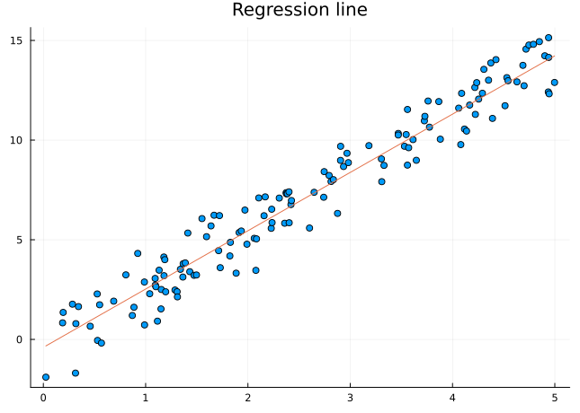

Introduction
================

## Example of test

Lorem ipsum dolor sit amet, consectetur adipiscing elit, sed do eiusmod
tempor incididunt ut labore et dolore magna aliqua. Ut enim ad minim
veniam, quis nostrud exercitation ullamco laboris nisi ut aliquip ex ea
commodo consequat. Duis aute irure dolor in reprehenderit in voluptate
velit esse cillum dolore eu fugiat nulla pariatur. Excepteur sint
occaecat cupidatat non proident, sunt in culpa qui officia deserunt
mollit anim id est laborum.

## Normalization process

$$KL(\hat{y} || y) = \sum_{c=1}^{M}\hat{y}_c \log{\frac{\hat{y}_c}{y_c}}$$

## Example code

## Example Multicols

<table>
<colgroup>
<col style="width: 50%" />
<col style="width: 50%" />
</colgroup>
<tbody>
<tr class="odd">
<td style="text-align: center;">

<h3 id="list-one">List One</h3>
<ul>
<li>Item A</li>
<li>Item B</li>
<li>Item C</li>
</ul>

</td>
<td style="text-align: center;">

<h3 id="list-two">List Two</h3>
<ul>
<li>Item X</li>
<li>Item Y</li>
<li>Item Z</li>
</ul>

</td>
</tr>
</tbody>
</table>

